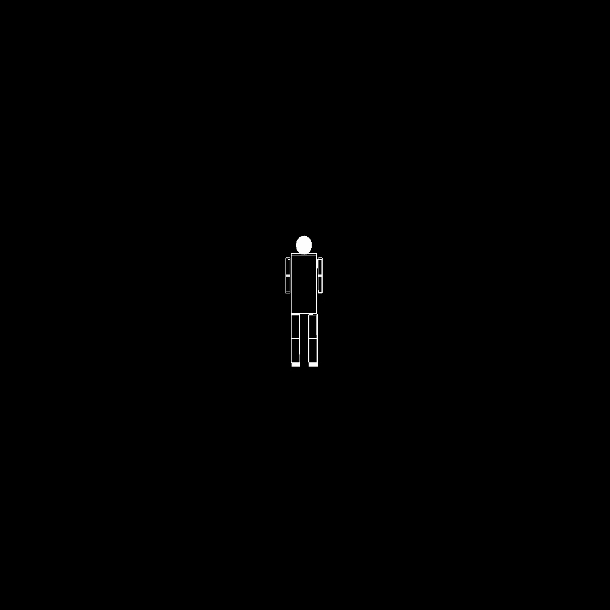

# Assignment 3 report - Camera movement


## Robot GIF


## Added Code
1. Code for Left() function
   ```void Left()
   {
       rotatePoint(up,-0.1,eye);
   }
	
} ```


1. Code for up() function
   ``` 
   {
        subtarct(eye,center,subtrationtemp);
	    crossProduct(subtrationtemp,up,crosstemp);
	    normalize(crosstemp);
	    rotatePoint(crosstemp,0.1,up);
	    rotatePoint(crosstemp,0.1,eye);
   }


3.Code for moveforward() function
   ```
   void moveForward()
{
	speed = speed + 0.005;
	direction[0] = center[0] - eye[0];
	direction[1] = center[1] - eye[1];
	direction[2] = center[2] - eye[2];

	eye[0]    += direction[0] * speed;
	eye[1]    += direction[1] * speed;
	eye[2]    += direction[2] * speed;

	center[0] += direction[0] * speed;
	center[1] += direction[1] * speed;
	center[2] += direction[2] * speed;
}
```

4.calling Left() and Right() functions in motion function for mouse movement
``` 
    static void motion(int x, int y)
    {
    if (moving) {
        angle = angle + (x - startx);
        angle2 = angle + (y - starty);
        if(angle < 0)
        {
            Left();
            
        }
            
        else
        {
            Right();
            

        }
            
        startx = x;
        starty = y;
        glutPostRedisplay();
    }
    }